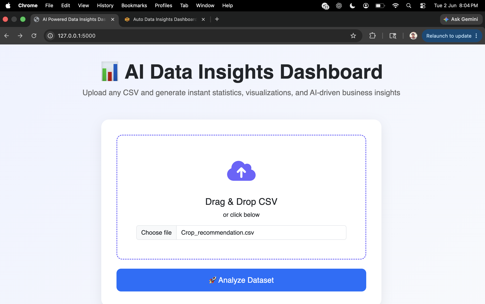
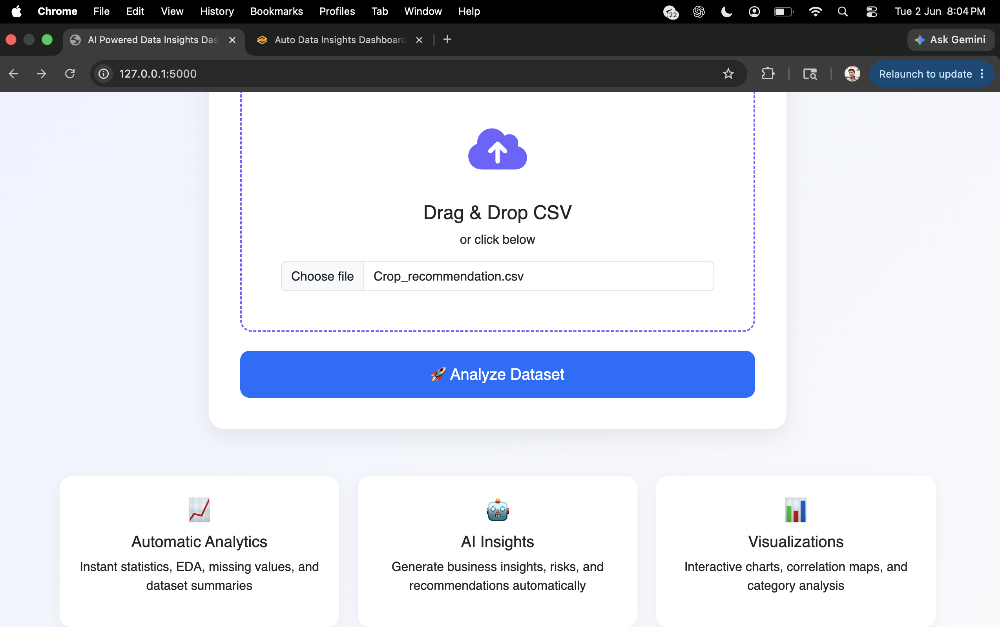
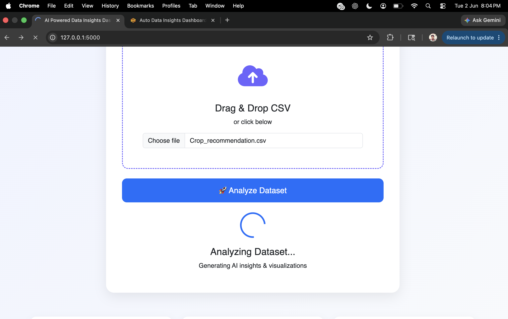
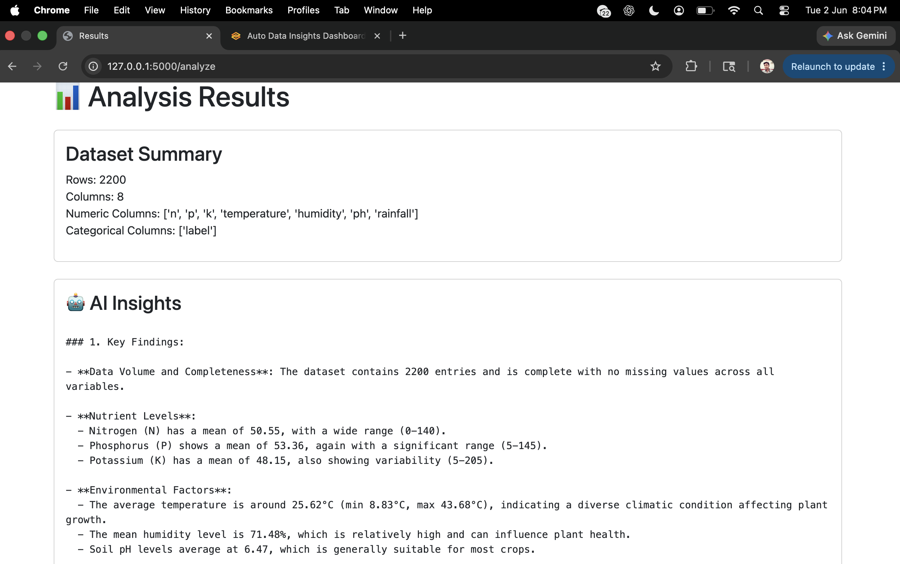
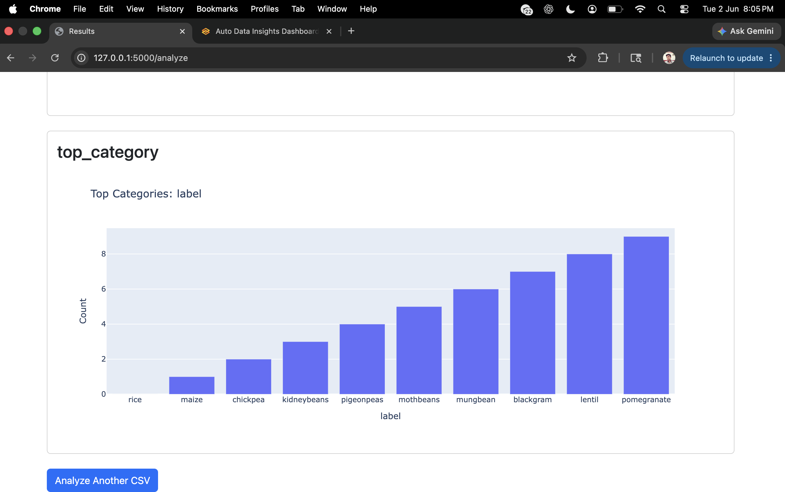
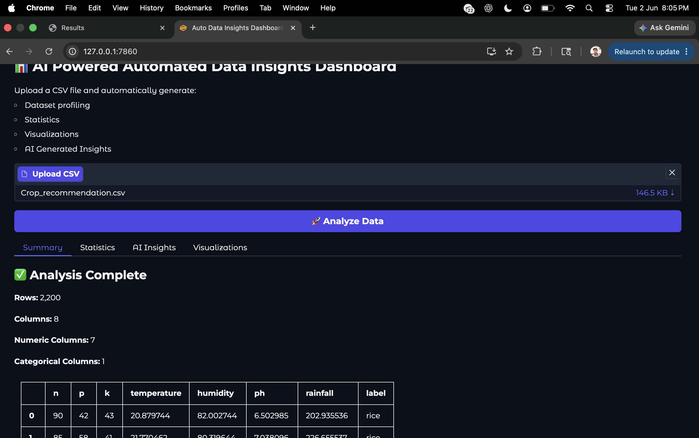
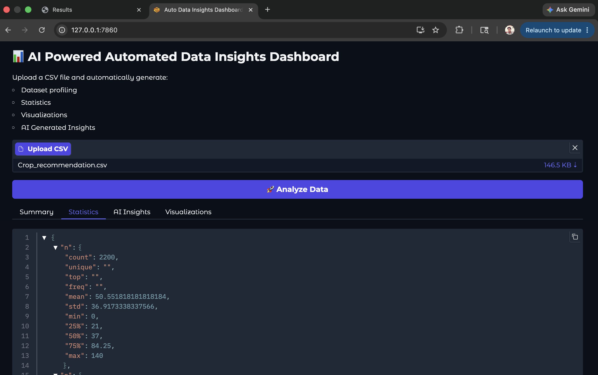
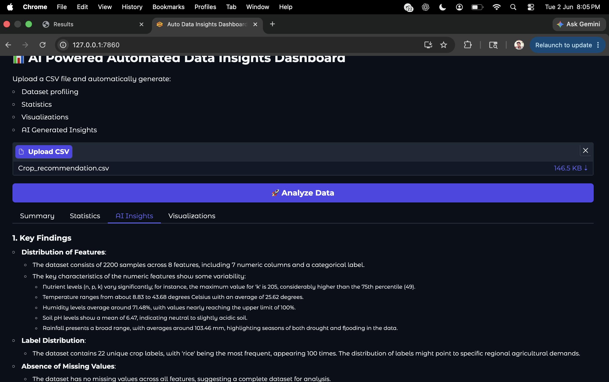
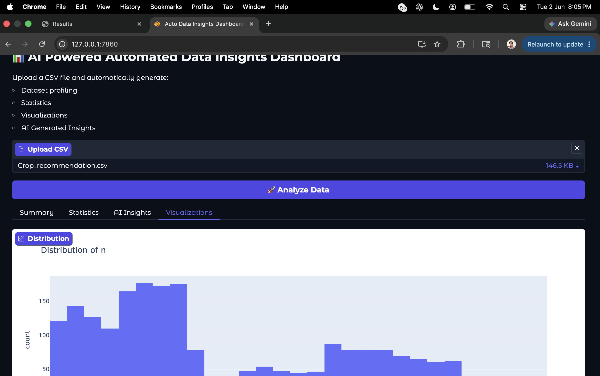

# 📊 AI-Powered Automated Data Insights Dashboard


An AI-powered analytics platform that automatically transforms raw CSV datasets into actionable business intelligence through automated data cleaning, exploratory data analysis (EDA), interactive visualizations, and LLM-generated insights.

The system acts as an intelligent data analyst by combining traditional analytics with Generative AI to help users quickly understand business trends, anomalies, risks, and opportunities.

---

## 🚀 Key Features

### 📁 Automated Data Ingestion

- CSV Upload Support
- Automatic Schema Detection
- Missing Value Handling
- Data Type Identification
- Column Standardization

### 📊 Exploratory Data Analysis

Automatically generates:

- Dataset Overview
- Summary Statistics
- Missing Value Analysis
- Correlation Analysis
- Distribution Analysis
- Top Category Insights

### 📈 Interactive Visual Analytics

Powered by Plotly:

- Histograms
- Correlation Heatmaps
- Category Comparisons
- Interactive Dashboards
- Zoom & Filter Support

### 🤖 AI-Powered Business Intelligence

Using GPT-based analysis:

- Executive Summary
- Key Findings
- Business Risks
- Opportunity Identification
- Strategic Recommendations
- Data Storytelling

---

## 🏗 System Architecture

```text
CSV Dataset
     │
     ▼
Data Cleaning Layer
     │
     ▼
EDA Engine
     │
     ▼
Visualization Engine
     │
     ▼
LLM Insight Generator
     │
     ▼
Business Dashboard
```

---

## 📂 Project Structure

```text
AI-Powered-Automated-Data-Insights/

├── app_flask.py
├── app_gradio.py
├── data_insights.py
├── ai_insights.py
├── requirements.txt
├── README.md

├── templates/
│   ├── index.html
│   └── results.html

├── uploads/

├── screenshots/
│   ├── dashboard.png
│   ├── insights.png
│   └── upload_page.png

└── docs/
    └── Project_Demo.pdf
```

---

## 📷 Application Screenshots

### Upload Interface












---


## 🛠 Technology Stack

### Backend

- Python
- Flask
- Gradio

### Data Processing

- Pandas
- NumPy

### Visualization

- Plotly

### AI Layer

- OpenAI GPT Models

### Deployment Ready

- Local Deployment
- Cloud Deployment
- Docker Ready (Future)

---

## ⚙ Installation

### Clone Repository

```bash
git clone https://github.com/nawdeep001/AI-Powered-Automated-Data-Insights.git

cd AI-Powered-Automated-Data-Insights
```

### Create Virtual Environment

```bash
python3 -m venv venv

source venv/bin/activate
```

### Install Dependencies

```bash
pip install -r requirements.txt
```

### Configure Environment Variables

Create a `.env` file:

```env
OPENAI_API_KEY=your_api_key

OPENAI_BASE_URL=https://api.openai.com/v1
```

---

## ▶ Running Flask Dashboard

```bash
python app_flask.py
```

Open:

```text
http://127.0.0.1:5000
```

---

## ▶ Running Gradio Interface

```bash
python app_gradio.py
```

Open:

```text
http://127.0.0.1:7860
```

---

## 📈 Sample Workflow

```text
Upload Dataset
      │
      ▼
Data Cleaning
      │
      ▼
Exploratory Data Analysis
      │
      ▼
Visualization Generation
      │
      ▼
GPT Insight Generation
      │
      ▼
Business Recommendations
```

---

## 🎯 Business Applications

- Sales Analytics
- Financial Reporting
- Procurement Intelligence
- Customer Analytics
- Marketing Analytics
- Vendor Evaluation
- Fraud Detection Support
- Operational Monitoring

---

## 🔮 Future Roadmap

- Excel & XLSX Support
- PDF Report Generation
- Automated PowerPoint Export
- Time-Series Forecasting
- Anomaly Detection
- Multi-File Analysis
- RAG-Based Dataset Q&A
- Agentic AI Data Analyst
- Multi-Agent Analytics Framework

---

# 🐳 Docker Support

This project supports containerized deployment using Docker, enabling consistent execution across development, testing, and production environments.

## Prerequisites

- Docker Desktop installed and running
- Docker Engine 28+ recommended

Verify installation:

```bash
docker --version
docker ps
```

---

## Build Docker Image

From the project root directory:

```bash
docker build -t ai-data-insights .
```

Verify image creation:

```bash
docker images
```

---

## Configure Environment Variables

Create a `.env` file in the project root:

```env
OPENAI_API_KEY=your_api_key

OPENAI_BASE_URL=https://api.openai.com/v1
```

> ⚠️ Never commit your `.env` file to GitHub.

---

## Run Docker Container

### Standard Run

```bash
docker run \
--env-file .env \
-p 5000:5000 \
ai-data-insights
```

Application will be available at:

```text
http://localhost:5000
```

---

## Persistent Upload Storage

To preserve uploaded datasets outside the container:

```bash
docker run \
--env-file .env \
-v $(pwd)/uploads:/app/uploads \
-p 5000:5000 \
ai-data-insights
```

This mounts the local `uploads` directory into the container and prevents uploaded files from being lost when containers are removed.

---

## View Running Containers

```bash
docker ps
```

---

## View Container Logs

```bash
docker logs <container_id>
```

---

## Stop Container

```bash
docker stop <container_id>
```

---

## Remove Container

```bash
docker rm <container_id>
```

---

## Docker Architecture

```text
┌──────────────────────┐
│     CSV Dataset      │
└──────────┬───────────┘
           │
           ▼
┌──────────────────────┐
│  Docker Container    │
│                      │
│  Flask Application   │
│  Data Processing     │
│  Plotly Dashboard    │
│  GPT Insights Engine │
└──────────┬───────────┘
           │
           ▼
┌──────────────────────┐
│ Browser Dashboard    │
└──────────────────────┘
```

---

## Benefits of Docker Deployment

- Reproducible execution environment
- Simplified deployment process
- Environment isolation
- Easy cloud migration
- Consistent dependency management
- Production-ready packaging

---

## Future Containerization Enhancements

- Docker Compose Support
- Multi-Container Architecture
- Nginx Reverse Proxy
- Kubernetes Deployment
- CI/CD Integration
- Cloud Deployment on AWS, Azure, and GCP

## 👨‍💻 Author

Nawdeep Kumar

AI Engineer | Machine Learning Researcher | Optimization Researcher

---

## ⭐ Support

If you find this project useful, consider giving it a star